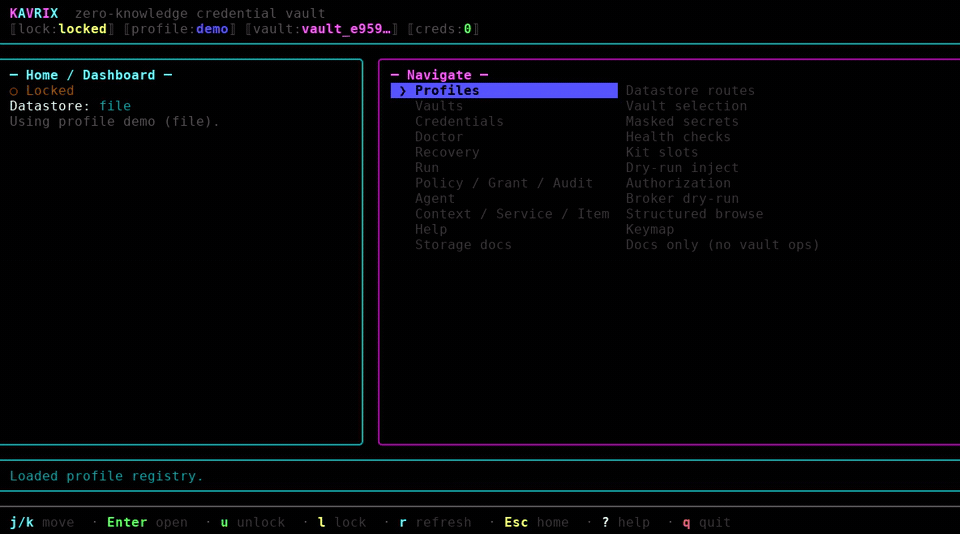

# Kavrix

**Secrets stay in Kavrix. Applications get access. Agents get permission.**

A local-first secrets firewall for developers, applications, and AI agents.

Zero-knowledge local encryption: Kavrix never sees your passphrases or plaintext credentials.

Give applications and AI agents access to credentials without handing them your
`.env`. Kavrix decides which process may receive a secret, under which policy
or grant, and records what happened — without shipping secrets to a Kavrix
cloud.


## Why not paste a `.env`?

- **Scoped secret execution** — inject only the credentials a command needs,
  for that process only (`kavrix run`).
- **Policies and grants** — bound executables, SHA-256 pins, TTLs, confirmation,
  max-use, and revocable temporary access.
- **AI agent isolation** — agents hold no credential material; they ask a local
  broker per operation (`kavrix agent run`).
- **Auditability** — review authorization and use events without secret
  plaintext (`kavrix audit`).
- **Local-first** — encrypted storage on your machine (local file or your own
  MongoDB). No Kavrix server, account, or telemetry.

The encrypted vault is infrastructure. The product is the secrets firewall in
front of it.

## Demo

Interactive management for the secrets firewall (profiles, vaults, credentials,
doctor, recovery, and more):

[](docs/assets/kavrix-tui-demo.mp4)

Video: [`docs/assets/kavrix-tui-demo.mp4`](docs/assets/kavrix-tui-demo.mp4).

```sh
kavrix init   # TUI onboarding on an interactive TTY (default)
kavrix tui    # full interactive app against the real CLI
```

Use `kavrix init --no-tui` for classic line prompts, or stdin/explicit routing
for scripts.

## Run tools without pasting secrets

```sh
# Inject selected credentials as environment variables only.
kavrix run --secret AWS_KEY=aws/deploy-key -- terraform plan
```

## AI agents

```sh
# Agent holds no credentials; the local broker authorizes each request.
kavrix agent run --agent bot --config kavrix.yaml \
  --profile work --vault <vault-id> \
  -- codex
```

Inside an agent session, children inherit broker access and request credentials
through `kavrix agent exec`. Denials are distinguishable from broken
connections, and `kavrix audit` records the events.

## Policies

```sh
# Bound what a credential may do before anything spawns.
kavrix policy create deploy --secret aws/deploy-key \
  --command terraform --hash terraform=<sha256> --ttl 30m --require-confirmation

# Simulate and explain without reading the credential.
kavrix policy check deploy -- terraform plan
kavrix policy explain deploy -- terraform plan
kavrix policy lint
kavrix policy diff deploy --secret aws/deploy-key --command terraform --ttl 15m
kavrix policy suggest
```

Policies support command allowlists, SHA-256 executable pins, execution-window
TTLs, working-directory restrictions, deny rules, reveal gating, and
confirmation requirements. Every decision is evaluated fail-closed before a
child process spawns. Policy simulation, explanation, linting, diffing, and
suggestions authenticate authorization metadata without decrypting credential
payloads or mutating the audit/state sidecar.

## Temporary grants

```sh
# Hand out access that expires and can be revoked.
kavrix grant create aws/deploy-key --ttl 15m --max-uses 3
kavrix grant list
kavrix grant show <grant-id>
kavrix grant revoke <grant-id>
```

## Audit

```sh
# Review what happened, without secret material.
kavrix audit
```

## Local-first storage

Secrets stay encrypted on your machine: a protected local database file or your
own MongoDB deployment. One database holds multiple independently encrypted
vaults. Unlock material never leaves your control — there is no Kavrix-hosted
service in the path.

Bring-your-own MongoDB is optional; local file is enough for most developer
workflows.

## Requirements

- Node.js `>=24.12.0 <25` or `>=25.1.0`
- MongoDB only if you use that datastore (writes need a replica set)

## Installation

```sh
npm install --global kavrix
kavrix --version
```

If npm fails with an engines/`EBADENGINE` error, your Node.js version
is outside `>=24.12.0 <25` or `>=25.1.0` — upgrade or switch before retrying.

If npm fails with `EACCES` (prefix often `/usr/local`):

```sh
npm config set prefix ~/.local
export PATH="$HOME/.local/bin:$PATH"
npm install --global kavrix
```

Published npm may lag git `main` (for example 0.2.10 on npm while main is
0.2.11). For tip-of-main from a clone:

```sh
pnpm install --frozen-lockfile && pnpm build
pnpm exec kavrix --version
```

An older global `kavrix` on `PATH` can shadow the workspace binary — prefer
`pnpm exec kavrix` or `node apps/cli/dist/bin.js` from a built checkout.

Or pack and install into a user prefix (preferred over `npm link --prefix`):

```sh
cd apps/cli && pnpm pack
npm install -g ./kavrix-*.tgz --prefix ~/.local
```

After a global npm install, keep current with:

```sh
kavrix update --check --json   # report only (exit 0); inspect updateAvailable
kavrix update                  # npm install --global kavrix@<newest>
```

`kavrix update` only replaces detected global npm installs. Homebrew, pnpm, yarn,
npx, and workspace checkouts refuse with the exact manual upgrade command.

## Quick start (local file)

Passphrases must be at least **16 bytes**. This non-interactive flow works
without a TTY. Profile registry: `~/.config/kavrix/`. Vault files here use
`~/.kavrix/`.

```sh
mkdir -p ~/.kavrix
kavrix db profile add work --datastore file \
  --data-file ~/.kavrix/work.kavrix --key-file ~/.kavrix/work.kavrix.key
kavrix db profile use work

PASS='MyPassphrase16chars!'

printf '%s\n' 'lab' "$PASS" "$PASS" \
  | kavrix db init --profile work --passphrase-stdin

printf '%s\n' "$PASS" 'default-vault' \
  | kavrix db vault create --profile work --passphrase-stdin
# Response includes created.id — copy it:
# VAULT_ID=vault_…

printf '%s\n' "$PASS" \
  | kavrix db vault use "$VAULT_ID" --profile work --passphrase-stdin

printf '%s\n' "$PASS" 'secret-value' \
  | kavrix put github/token --profile work --passphrase-stdin --value-stdin

printf '%s\n' "$PASS" | kavrix list --profile work --passphrase-stdin

printf '%s\n' "$PASS" \
  | kavrix run --profile work --passphrase-stdin \
      --secret TOKEN=github/token -- printenv TOKEN
```

`kavrix run` injects only requested env vars into the child after `--`.

Stdin frame order (`kavrix frames "<command>"`): `db init` → label,
passphrase, confirm; `db vault create` → passphrase, label; `db vault use` →
passphrase; `put` → passphrase, value (MongoDB adds an optional leading
`mongodb-url` frame).

Without `--profile`, root `put` / `get` / `list` / … default `--datastore` to
**file** (aligned with `kavrix init`). Pass `--datastore mongodb` explicitly for
MongoDB, or prefer `--profile` after onboarding.

Interactive TTY `kavrix init` opens Ink onboarding by default and stores under
`~/.kavrix/`. Pass `--no-tui` for classic masked prompts. Scripted file init
(`--json` / `--passphrase-stdin`) creates a bound database-container profile so
`put` and `kavrix run` work immediately; add `--recovery-file` for a kit, or
`--legacy` only for version-2 migrate sources.

**Node.js engines (required):** `>=24.12.0 <25` or `>=25.1.0`.

## Interactive TUI

On Linux, macOS, and Windows with Node.js `>=24.12.0`, Kavrix ships a real Ink
terminal UI for managing the secrets firewall (no mocks — every action runs the
same CLI):

```sh
kavrix init   # TUI onboarding on an interactive TTY (default)
kavrix tui    # full app: profiles, vaults, credentials, doctor, recovery, …
```

Use `kavrix init --no-tui` for classic line prompts, or stdin/explicit routing
for scripts. Demo walkthrough:

[](docs/assets/kavrix-tui-demo.mp4)

Video: [`docs/assets/kavrix-tui-demo.mp4`](docs/assets/kavrix-tui-demo.mp4).

## Credential model

The structured model supports field definitions such as username, password, API
key, URL, certificate, TOTP seed, recovery-code list, JSON, and environment-map
values. Each field carries its own copy, reveal, reauthentication, and export
policies, so policy decisions remain schema-driven. New database vaults use a
versioned structured payload; existing flat database payloads remain readable
and writable through the root commands and are upgraded only by explicit
structured access or migration.

## Everyday commands

| Command                     | Purpose                                              |
| --------------------------- | ---------------------------------------------------- |
| `kavrix put <name>`         | Add a value; replacing one requires `--overwrite`.   |
| `kavrix get <name>`         | Read metadata; `--reveal` is required for plaintext. |
| `kavrix list`               | List names without values.                           |
| `kavrix view [name]`        | Show a sanitized dashboard or one credential card.   |
| `kavrix search <pattern>`   | Search credential names only.                        |
| `kavrix stats`              | Non-secret counts, sizes, and revisions.             |
| `kavrix has <name>`         | Check whether a name exists.                         |
| `kavrix rename <from> <to>` | Rename a record while keeping its encrypted value.   |
| `kavrix remove <name>`      | Delete a record.                                     |

### Databases, profiles, and vaults

| Command                   | Purpose                                                   |
| ------------------------- | --------------------------------------------------------- |
| `kavrix db profile ...`   | Add, select, inspect, or remove non-secret routes.        |
| `kavrix db init`          | Create an encrypted database and protected owner key.     |
| `kavrix db status`        | Authenticate and inspect the selected database.           |
| `kavrix db vault ...`     | Create, list, inspect, rename, or select database vaults. |
| `kavrix db key create`    | Create an exact-snapshot key for full local-file sharing. |
| `kavrix db recovery ...`  | Manage database-root recovery kits.                       |
| `kavrix migrate database` | Copy one legacy version 2 vault into a database.          |
| `kavrix db ping`          | Test a direct MongoDB connection.                         |

### Keys, recovery, and health

| Command                | Purpose                                                                             |
| ---------------------- | ----------------------------------------------------------------------------------- |
| `kavrix key ...`       | Verify, copy, replicate, assign, or rewrap key files.                               |
| `kavrix recovery ...`  | Create, verify, inspect, revoke, or use recovery kits.                              |
| `kavrix doctor`        | Authenticate and validate a vault without revealing values.                         |
| `kavrix doctor health` | Diagnose and safely repair bounded transient state.                                 |
| `kavrix tui` / `ui`    | Full interactive Ink app against the real CLI.                                      |
| `kavrix init`          | TTY: Ink onboarding; scripted file init binds profile for put/run; `--legacy` = v2. |

## Quick start (MongoDB)

Needs a replica-set URI. Profiles do not store the connection string — supply it
as the first stdin frame on each `db …` command. Root credential commands also
take `--database-url-stdin`.

```sh
mkdir -p ~/.kavrix
kavrix db profile add mongo --datastore mongodb --database kavrix_e2e \
  --key-file ~/.kavrix/mongo.kavrix.key
kavrix db profile use mongo

URI='mongodb://127.0.0.1:27017/kavrix_e2e?replicaSet=rs0'
PASS='MyPassphrase16chars!'

printf '%s\n' "$URI" 'lab' "$PASS" "$PASS" \
  | kavrix db init --profile mongo --passphrase-stdin

printf '%s\n' "$URI" "$PASS" 'default-vault' \
  | kavrix db vault create --profile mongo --passphrase-stdin
# VAULT_ID from created.id / vaultId

printf '%s\n' "$URI" "$PASS" \
  | kavrix db vault use "$VAULT_ID" --profile mongo --passphrase-stdin

printf '%s\n' "$URI" "$PASS" 'secret-value' \
  | kavrix put github/token --profile mongo --passphrase-stdin --database-url-stdin --value-stdin

printf '%s\n' "$URI" "$PASS" \
  | kavrix list --profile mongo --passphrase-stdin --database-url-stdin
```

More detail: [Command guide](docs/cli-reference.md), [CONTRIBUTING.md](CONTRIBUTING.md).

## Options worth knowing

| Flag                                | What it does                                                               |
| ----------------------------------- | -------------------------------------------------------------------------- |
| `--profile`, `--profile-config-dir` | Select a datastore profile without storing secrets.                        |
| `--config-dir <path>`               | Alias of `--profile-config-dir` for profile registry routing.              |
| `--vault <id>`                      | Override the selected profile's default vault for one command.             |
| `--passphrase-stdin`                | Read the key passphrase from stdin.                                        |
| `--database-url-stdin`              | Read the MongoDB URI from stdin.                                           |
| `--value-stdin`                     | Read a credential value from stdin.                                        |
| `--secrets-stdin`                   | Read every unlock secret from exact stdin frames.                          |
| `--reveal`                          | The explicit guard that prints plaintext.                                  |
| `--json`                            | Masked machine-readable output.                                            |
| `--overwrite`                       | Opt in to replacing something that already exists.                         |
| `--allow-insecure-transport`        | Explicit opt-in to unencrypted MongoDB transport (isolated networks only). |

Without `--profile`, root credential commands default `--datastore` to
**file** (same `datastoreFrom` rule as Quick start above). Pass
`--datastore mongodb` explicitly when you need MongoDB without a profile.

`kavrix <command> --help` is authoritative for your installed version.

## Backups and recovery

Keep at least one database recovery kit on separate protected media from the
active owner key, and verify it with
`kavrix db recovery verify --profile work --recovery-file <path>` before you
rely on it. Back up datastore ciphertext and protected recovery material
separately.

For local-file sharing, generate a fresh share key with `kavrix db key create`
and transfer it together with the exact matching database file. That pair grants
full access to every vault once its passphrase is known; there is no
vault-scoped local sharing or revocation.

If every valid owner key file and every recovery kit is lost, the database is
permanently unrecoverable by design. There is no vendor reset or escrow, because
no one else ever held the required material.

## Security model

Kavrix controls which process receives a credential. Once an authorized process
receives it, Kavrix cannot control what that program does with the value.

Cryptography uses versioned authenticated encryption, not "unbreakable
encryption." Vault payloads, the private database catalog, and wrapped keys use
XChaCha20-Poly1305. Passphrase-protected files derive keys with Argon2id.
HKDF-SHA-256 separates key purposes, and associated data binds every ciphertext
to the exact database, vault, purpose, key version, revision, and metadata
digest.

A revision anchor authenticated by the database root key is stored beside each
active owner key file. Rollback attempts, same-revision forks, and inconsistent
catalog/vault heads are rejected before plaintext is returned, and a missing or
invalid anchor fails closed. Structured contexts, groups/services, item
metadata, field definitions, notes, and attachment/history relationships stay
inside the client-encrypted vault payload.

MongoDB stores ciphertext plus opaque routing metadata in two collections. It
can observe the MongoDB database and collection namespaces, opaque IDs,
revisions, timestamps, ciphertext sizes, and access patterns. Human-readable
Kavrix database labels, vault labels, credential labels, and values remain
encrypted. Remote connections must explicitly enable validated TLS.

Details: [threat model](docs/threat-model.md),
[cryptography](docs/cryptography.md), [data model](docs/data-model.md).

## Limitations

- Kavrix cannot protect an unlocked host from administrators, same-user malware,
  keyloggers, terminal capture, clipboard capture, process-memory inspection, or
  swap and crash dumps. Secret buffers are cleared best effort; JavaScript
  cannot guarantee complete erasure.
- An authorized program can read its own environment. Execution controls add
  authorization and process hygiene; they do not constrain what a legitimate
  program does with values it was given.
- User identities, public enrollment, recipient discovery, per-vault grants and
  roles, revocation with rotation, and ownership transfer are not implemented.
- Project contexts, groups/services, structured items, typed fields, notes,
  expiry/rotation metadata, and encrypted attachment/history records are
  modeled in database vaults. Root flat commands intentionally expose only the
  default context/service projection; the current CLI does not claim
  attachment/history transfer or mutation commands.
- Windows command scripts (`.bat`, `.cmd`, `.com`) are refused for execution
  because launching them requires shell argument re-parsing; invoke real
  executables.

See [implementation status](docs/implementation-status.md) for the full factual
ledger of what is implemented and verified.

## Documentation

Start with the [documentation index](docs/README.md):

- [Command guide](docs/cli-reference.md)
- [Threat model](docs/threat-model.md)
- [Recovery guide](docs/backup-and-recovery.md)
- [Datastore policy](docs/local-database.md)
- [Architecture](docs/architecture.md)

## Support

Security issues follow [SECURITY.md](SECURITY.md); please do not open public
issues for them. Bug reports and feature requests go to the
[issue tracker](https://github.com/d4rkNinja/kavrix/issues). Contributions are
described in [CONTRIBUTING.md](CONTRIBUTING.md). The published npm package is
built through GitHub Actions with trusted publishing and provenance.

## License

[MIT](LICENSE)
