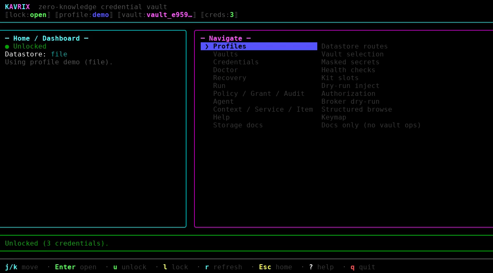

# kavrix

**Secrets stay in Kavrix. Applications get access. Agents get permission.**

Local-first secrets firewall for developers, applications, and AI agents.

Kavrix provides zero-knowledge local encryption: it never sees your passphrases or plaintext credentials.

Give applications and AI agents access to credentials without handing them your
`.env`. `kavrix run` injects only the values a process needs; policies and
temporary grants bound what each executable may do; `kavrix agent run` brokers
every request from AI coding agents. Encrypted storage stays on your machine
(local file or your own MongoDB) — no Kavrix server, account, or telemetry.



## Installation

```sh
npm install --global kavrix
kavrix --version
kavrix --help
kavrix update --check
```

`kavrix update` upgrades a **global npm** install of `kavrix` from the registry
(`--check` never installs and always exits 0; `--json` emits
`{ installed, latest, updateAvailable, channel, action, error? }`). Unsupported:
Homebrew, pnpm, yarn, npx, workspace/dev checkouts.

Requires Node.js `>=24.12.0 <25` or `>=25.1.0`. MongoDB is needed only if you
select that datastore; database writes require a transaction-capable replica
set or sharded topology.

## Run a command with scoped secrets

```sh
kavrix run --secret AWS_KEY=aws/deploy-key -- terraform plan

kavrix policy create deploy --secret aws/deploy-key \
  --command terraform --hash terraform=<sha256> --ttl 30m --require-confirmation
kavrix policy check deploy -- terraform plan
kavrix policy explain deploy -- terraform plan
kavrix policy lint
kavrix policy suggest

kavrix grant create aws/deploy-key --ttl 15m --max-uses 3
kavrix grant show <grant-id>

kavrix agent run --agent bot --config kavrix.yaml --profile work -- codex
kavrix audit
```

Policies are evaluated fail-closed before any child process spawns, grants are
consumed atomically and can be revoked immediately, and `kavrix audit` records
policy, grant, authorization, and completion events without secret material.

## Interactive TUI

Manage the secrets firewall interactively (profiles, vaults, credentials,
doctor, recovery). On Linux, macOS, and Windows with Node.js `>=24.12.0`,
Kavrix ships a real Ink terminal UI — every action runs the same CLI:

```sh
kavrix init   # TUI onboarding on an interactive TTY (default)
kavrix tui    # full app
```

Use `kavrix init --no-tui` for classic line prompts, or stdin/explicit routing
for scripts.


Full video on GitHub:
[kavrix-tui-demo.mp4](https://github.com/d4rkNinja/kavrix/blob/main/docs/assets/kavrix-tui-demo.mp4).

## Quick start

For a new local-file setup on an interactive TTY:

```sh
kavrix init
```

TTY Ink onboarding (`kavrix init`, or `kavrix init --no-tui` for classic masked
prompts) preflights destinations, creates an encrypted database-container,
one default vault, a verified recovery kit, and selects the new profile so
`put` / `get` / `kavrix run` work next.

Scripted / non-TTY file init (`--json` / `--passphrase-stdin`) also creates a
bound database-container profile so `put` and `kavrix run` work immediately.
It does **not** create a recovery kit unless you pass `--recovery-file` (then
it creates and verifies the kit in the same invocation). Pass `--legacy` only
when you need a version-2 single-vault migrate source. MongoDB scripted setup
uses `db profile` / `db init` / `db vault` (see below), or `--legacy` for
migrate sources.

**After init (interactive or scripted file), typical next commands:**

```sh
kavrix put github/token
kavrix list
kavrix get github/token --reveal
kavrix run --secret TOKEN=github/token -- printenv TOKEN
```

`kavrix run` requires a command after `--` (the child executable and its args).
Without `--profile`, root `put` / `get` / `list` default `--datastore` to
**file** (aligned with `init`). Prefer `--profile` after onboarding; pass
`--datastore mongodb` explicitly for MongoDB without a profile.

**Node.js engines (required):** `>=24.12.0 <25` or `>=25.1.0`. If npm fails
with an engines/`EBADENGINE` error, switch Node before retrying.

Protected labels and passphrases never enter argv, environment variables, or
the generated non-secret config reference.

For MongoDB or explicitly routed setup, use the database commands directly:

```sh
# 1. Register and select a non-secret route to your datastore.
kavrix db profile add work --datastore file \
  --data-file ./work.kavrix --key-file ./work.kavrix.key
kavrix db profile use work

# 2. Initialize the database and create a vault.
kavrix db init --profile work
kavrix db vault create --profile work

# 3. Authenticate and select the returned opaque vault ID for this profile.
kavrix db vault use <vault-id> --profile work

# 4. Vault-scoped commands now use that profile default.
kavrix put github/token --profile work
kavrix get github/token --reveal --profile work

# Or create an explicit project/service/item hierarchy.
kavrix context create platform --environment production --profile work
kavrix service create github --context platform --profile work
kavrix item create deploy --context platform --service github --profile work
kavrix field set token --type api-key --context platform --service github \
  --item deploy --profile work
```

Sensitive input is prompted for or read from stdin; it is never accepted as a
normal argument. Use `kavrix <command> --help` for the exact protected-input
options in your installed version.

Interactive protected prompts show each non-secret requirement before entry
and keep `[i]`, `[OK]`, and `[X]` meaningful without color. Invalid local input
retries only that field, while a confirmation mismatch retries both passphrase
entries. ANSI color is TTY-only and respects `NO_COLOR` and `TERM=dumb`;
protected stdin remains silent and ANSI-free.

Each datastore profile keeps its own opaque default vault ID in the protected
non-secret registry. An explicit `--vault <id>` overrides it for one invocation.
Without either selection, Kavrix fails before requesting secret input. Profiles
never store MongoDB credentials, passphrases, private labels, keys, or values.

## Command overview

| Group                                                                      | Purpose                                                                               |
| -------------------------------------------------------------------------- | ------------------------------------------------------------------------------------- |
| `run`                                                                      | Execute one command with selected credentials injected as environment variables only. |
| `policy create/list/show/remove/check/explain/lint/diff/suggest`           | Stored rules plus read-only simulation, diagnostics, previews, and narrowing advice.  |
| `grant create/list/show/revoke`                                            | Temporary consumable authorizations with live expiry, restrictions, and use caps.     |
| `audit`                                                                    | Plaintext-free security audit trail.                                                  |
| `agent run`, `agent exec`                                                  | Credential firewall that brokers AI coding agents.                                    |
| `db profile ...`                                                           | Manage non-secret datastore routes.                                                   |
| `db init`, `db status`                                                     | Initialize or authenticate a multi-vault database.                                    |
| `db vault ...`                                                             | Create, list, inspect, rename, or select encrypted vaults.                            |
| `db key create`                                                            | Create an exact-snapshot key for full local-file sharing.                             |
| `db recovery ...`                                                          | Manage database-root recovery kits.                                                   |
| `migrate database`                                                         | Copy one legacy version 2 vault into a database.                                      |
| `context`, `service`, `item`, `field`                                      | Manage structured project credentials and schema-driven typed fields.                 |
| `put`, `get`, `list`, `view`, `search`, `stats`, `has`, `rename`, `remove` | Store, read, and organize credentials.                                                |
| `key status/verify/copy/replicate/assign/rewrap`                           | Manage protected key files.                                                           |
| `recovery create/verify/status/revoke/use`                                 | Manage recovery kits.                                                                 |
| `doctor`, `doctor health`                                                  | Validate a vault; repair bounded transient state safely.                              |
| `update`                                                                   | Upgrade a global npm install (`--check` / `--json`; npm-global only).                 |
| `tui` / `ui`                                                               | Full interactive Ink app against the real CLI (TTY required).                         |
| `init`, `vault`, `legacy v2 commands`                                      | TTY: Ink onboarding; scripted file init binds a profile for put/run; `--legacy` = v2. |

Sensitive plaintext output is opt-in through `--reveal` or multiline-safe
`--reveal-base64`; listing and dashboard commands never display field values.
`field get` may return a non-sensitive value according to its schema.

Database vaults organize private data as project context/environment →
service/group → credential item → typed fields. The root flat commands remain
a compatibility projection over the default context/service and never split a
literal name such as `github/token` into hierarchy segments. Field definitions
carry copy, reveal, reauthentication, and export policies; present values stay
redacted until an allowed explicit reveal.

## Options worth knowing

| Flag                                | What it does                                                               |
| ----------------------------------- | -------------------------------------------------------------------------- |
| `--profile`, `--profile-config-dir` | Select a datastore profile without storing secrets.                        |
| `--vault <id>`                      | Override the selected profile's default vault for one command.             |
| `--passphrase-stdin`                | Read the key passphrase from stdin.                                        |
| `--database-url-stdin`              | Read the MongoDB URI from stdin.                                           |
| `--value-stdin`                     | Read a credential value from stdin.                                        |
| `--secrets-stdin`                   | Read every unlock secret from exact stdin frames.                          |
| `--reveal`                          | The explicit guard that prints plaintext.                                  |
| `--reveal-base64`                   | Authorized multiline-safe field-value output.                              |
| `--json`                            | Masked machine-readable output.                                            |
| `--overwrite`                       | Opt in to replacing something that already exists.                         |
| `--allow-insecure-transport`        | Explicit opt-in to unencrypted MongoDB transport (isolated networks only). |

## Security honesty

Kavrix controls which process receives a credential. Once an authorized process
receives it, Kavrix cannot control what that program does.

Vault payloads, the private database catalog, and wrapped keys use
XChaCha20-Poly1305 authenticated encryption. Protected key and recovery files
derive keys with Argon2id; HKDF-SHA-256 separates key purposes. Ciphertext is
bound to exact database/vault identity, purpose, versions, revision, and a
metadata digest, and a root-key-authenticated local revision anchor rejects
rollback, forks, and inconsistent heads before plaintext is returned.

MongoDB stores ciphertext plus opaque routing metadata in two collections; it
never receives passphrases, root keys, labels, or decrypted values. Remote URIs
must explicitly enable validated TLS.

Deep security docs on GitHub:

- [Threat model](https://github.com/d4rkNinja/kavrix/blob/main/docs/threat-model.md)
- [Cryptography](https://github.com/d4rkNinja/kavrix/blob/main/docs/cryptography.md)
- [Implementation status](https://github.com/d4rkNinja/kavrix/blob/main/docs/implementation-status.md)

## Limitations

- Kavrix cannot protect an unlocked machine from administrators, same-user
  malware, keyloggers, terminal capture, or process-memory inspection, and an
  authorized program can always read its own environment.
- Losing all valid owner keys and all database recovery kits makes the database
  permanently unrecoverable by design; there is no reset or escrow.
- User identities, public enrollment, per-vault grants and roles, revocation
  with rotation, and ownership transfer are not yet implemented. Structured
  payloads model notes, attachment ownership, and history, but the current CLI
  does not add attachment transfer or history-restore commands.
- Windows command scripts (`.bat`, `.cmd`, `.com`) are refused for execution;
  invoke real executables.

For local sharing, create a fresh share key with `kavrix db key create` and
transfer it with its exact matching encrypted database file; deliver the
passphrase separately. The pair grants access to all vaults once unlocked.

## Documentation and support

- [Full README](https://github.com/d4rkNinja/kavrix#readme)
- [Command guide](https://github.com/d4rkNinja/kavrix/blob/main/docs/cli-reference.md)
- [Security reports](https://github.com/d4rkNinja/kavrix/blob/main/SECURITY.md)
- [Issue tracker](https://github.com/d4rkNinja/kavrix/issues)

## Word-list attribution

Generated passphrases use **EFF Short Wordlist for Passphrases #1**, from
https://www.eff.org/files/2016/09/08/eff_short_wordlist_1.txt, licensed under
CC BY 4.0: https://creativecommons.org/licenses/by/4.0/.

## License

MIT
